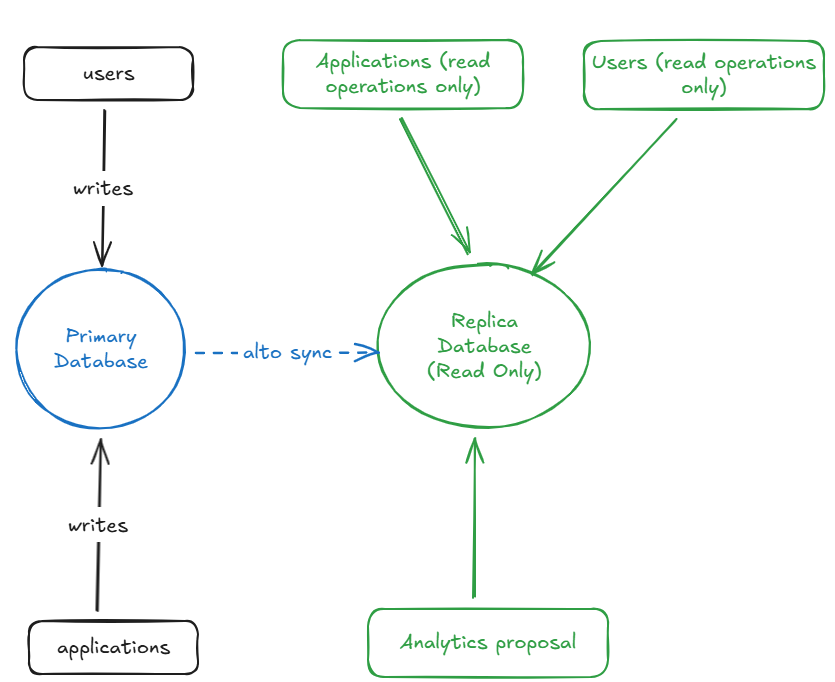

# Postgres-Read-Replica-Simulation

## About
This project have the proposal to simulate a read replica infrastucture in postgres (physical replication).



## Commands

```shell
# Creating postgres instancies
docker-compose up

# Acessing prostgres shell for primary database (read and write operations)
make primary-db-shell

# Acessing prostgres shell for replica database (readonly)
make replica-db-shell
```

## Operations

```shell
# writing operation
make primary-db-shell

insert into products (sku, name, price_cents) values ('SKU-4', 'Coke 200ML', 150), ('SKU-5', 'Coke 350ML', 210);

select * from products where sku in('SKU-4', 'SKU-5');

# Acessing replica database (readonly) and executing read operation
make replica-db-shell

select * from products where sku in('SKU-4', 'SKU-5');
```